# User Journey: Observability for Tool Execution

## Scenario

You want to instrument tool execution with tracing and metrics, exporting to
OTLP for traces and Prometheus for metrics. You also want structured logs for
failed tool calls.

## Step 1: Configure observer

```go
cfg := toolobserve.Config{
    ServiceName: "metatools",
    Version:     "0.1.0",
    Tracing: toolobserve.TracingConfig{
        Enabled:  true,
        Exporter: "otlp",
    },
    Metrics: toolobserve.MetricsConfig{
        Enabled:  true,
        Exporter: "prometheus",
    },
    Logging: toolobserve.LoggingConfig{Enabled: true},
}
observer, _ := toolobserve.NewObserver(cfg)
```

## Step 2: Wrap execution

```go
mw := toolobserve.NewMiddleware(observer)
wrapped := mw.Wrap(toolrunExecutor)
_ = wrapped
```

## Step 3: Inspect telemetry

- Spans appear as `tool.mcp.search` with duration and error tags.
- Metrics show execution counts and latency histograms.
- Logs include tool ID, inputs (redacted), and error messages.

## Flow Diagram

```mermaid
%%{init: {'theme': 'base', 'themeVariables': {'primaryColor': '#e53e3e'}}}%%
flowchart LR
    subgraph input["Input"]
        A["📥 Tool Call"]
    end

    subgraph middleware["Middleware Layer"]
        B["🔀 Middleware.Wrap()"]
        C["👁️ Observer"]
    end

    subgraph telemetry["Telemetry"]
        D["🔍 Tracing<br/><small>tool.exec.{ns}.{name}</small>"]
        E["📊 Metrics<br/><small>counters, histograms</small>"]
        F["📝 Logging<br/><small>structured fields</small>"]
    end

    subgraph exporters["Exporters"]
        G["📡 OTLP"]
        H["📈 Prometheus"]
        I["🔍 Jaeger"]
        J["🖥️ Stdout"]
    end

    A --> B --> C
    C --> D
    C --> E
    C --> F
    D --> G
    D --> I
    E --> H
    E --> G
    F --> J

    style input fill:#3182ce,stroke:#2c5282
    style middleware fill:#e53e3e,stroke:#c53030,stroke-width:2px
    style telemetry fill:#6b46c1,stroke:#553c9a
    style exporters fill:#d69e2e,stroke:#b7791f
```



## Observability Architecture


